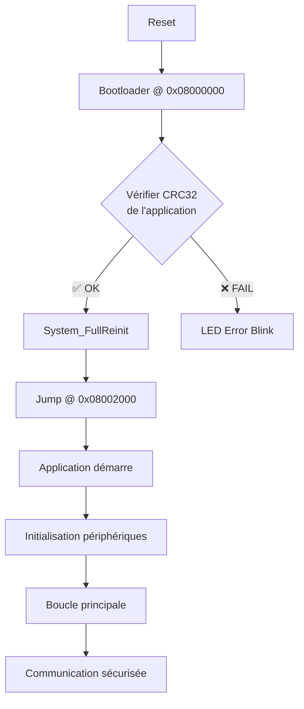

# 🔐 STM32 Secure Boot & Application

> **Système de démarrage sécurisé et application protégée pour STM32F103**  
> Architecture complète avec chiffrement AES-128-CBC, authentification HMAC-SHA256, et protection anti-replay

---

## 📋 Table des matières

- [Vue d'ensemble](#-vue-densemble)
- [Architecture](#-architecture)
- [Technologies utilisées](#-technologies-utilisées)
- [Caractéristiques](#-caractéristiques)
- [Prérequis](#-prérequis)
- [Installation](#-installation)
- [Compilation](#-compilation)
- [Flashage](#-flashage)
- [Indicateurs LED (vérification du flashage)](#-indicateurs-led-vérification-du-flashage)
- [Utilisation](#-utilisation)
- [Protocole de communication](#-protocole-de-communication)
- [Sécurité](#-sécurité)
- [Structure des projets](#-structure-des-projets)
- [Troubleshooting](#-troubleshooting)
- [Roadmap](#-roadmap)

---

## 🎯 Vue d'ensemble

Ce projet implémente un **système de démarrage sécurisé (secure boot)** et une **application protégée** pour microcontrôleur STM32F103. Le système comprend deux composants principaux:

### 1. **Bootloader Sécurisé** (`stm32_secure_boot`)
- Situé à l'adresse **0x08000000** (8 KB)
- Vérifie l'intégrité de l'application via **CRC32**
- Effectue un saut sécurisé vers l'application
- Réinitialisation complète du système avant le saut

### 2. **Application Sécurisée** (`stm32_secure_application`)
- Située à l'adresse **0x08002000** (48 KB)
- Communication série chiffrée (**AES-128-CBC**)
- Authentification des messages (**HMAC-SHA256**)
- Protection **anti-replay** avec compteur de séquence
- Support des formats **JSON** et **TEXT**

---

## 🏗️ Architecture

### Carte mémoire Flash

```
┌─────────────────────────────────────────────┐
│  0x08000000 - 0x08001FFF (8 KB)            │
│  🔐 BOOTLOADER SÉCURISÉ                    │
│  - Vérification CRC32                      │
│  - Réinitialisation système                │
│  - Saut vers application                   │
├─────────────────────────────────────────────┤
│  0x08002000 - 0x0800DFFF (48 KB)           │
│  📱 APPLICATION SÉCURISÉE                   │
│  - Communication chiffrée                  │
│  - Authentification HMAC                   │
│  - Anti-replay                             │
│  - Contrôle LED, PWM, ADC                  │
└─────────────────────────────────────────────┘
```

### Flux de démarrage



---

## 🔧 Technologies utilisées

### Périphériques STM32

| Périphérique | Usage | Configuration |
|--------------|-------|---------------|
| **USART1** | Communication série | 115200 bps, 8N1, PA9/PA10 |
| **TIM2** | PWM génération | Channel 1 (PA0), 1 kHz |
| **ADC1** | Lecture tension | PA1 + Temperature interne |
| **GPIO** | LED contrôle | PC13 (active LOW) |
| **CRC** | Vérification intégrité | Hardware CRC32 |
| **RCC** | Clock configuration | 72 MHz (HSE + PLL) |
| **NVIC** | Gestion interruptions | Priorités configurables |

### Communication et Protocole

| Technologie | Implémentation | Détails |
|-------------|----------------|---------|
| **UART Interrupt-driven** | ✅ Réception asynchrone | Buffer circulaire 512 bytes |
| **DMA UART** | ⚠️ Optionnel | Transferts sans CPU |
| **JSON Parser** | ✅ Custom lightweight | Parsing manuel optimisé |
| **TEXT Parser** | ✅ Commandes simples | Format `CMD:ARGS` |

### Cryptographie

| Algorithme | Bibliothèque | Usage |
|------------|--------------|-------|
| **AES-128-CBC** | mbedTLS | Chiffrement messages |
| **HMAC-SHA256** | mbedTLS | Authentification |
| **CRC32** | Hardware STM32 | Intégrité bootloader |
| **PRNG** | STM32 RNG (si disponible) | IV génération |

### Gestion de la mémoire

| Feature | Status | Description |
|---------|--------|-------------|
| **Stack Protection** | ✅ | Vérification overflow |
| **Heap Management** | ⚠️ Limité | malloc() évité |
| **MPU** | ❌ Non configuré | Protection mémoire HW |
| **Flash Protection** | ⚠️ Partiel | RDP Level 0 (dev) |

### Architecture logicielle

```
┌────────────────────────────────────────────┐
│         HAL (Hardware Abstraction)         │
│  UART | GPIO | TIM | ADC | CRC | Flash    │
├────────────────────────────────────────────┤
│           Drivers & Middleware             │
│  Crypto | Protocol | Peripherals           │
├────────────────────────────────────────────┤
│            Application Logic               │
│  Command Parser | State Machine            │
├────────────────────────────────────────────┤
│          Security Layer (App)              │
│  AES-128-CBC | HMAC-SHA256 | Anti-Replay  │
└────────────────────────────────────────────┘

        ↑ Jump from Bootloader ↑
        
┌────────────────────────────────────────────┐
│          Bootloader (8 KB)                 │
│  CRC32 Verify | System Reinit | Jump       │
└────────────────────────────────────────────┘
```

### Interruptions utilisées

| IRQ | Priorité | Usage | Handler |
|-----|----------|-------|---------|
| **USART1_IRQn** | 1 | Réception UART | `USART1_IRQHandler()` |
| **TIM2_IRQn** | 2 | PWM update | `TIM2_IRQHandler()` |
| **ADC1_2_IRQn** | 3 | Conversion ADC | `ADC1_2_IRQHandler()` |
| **DMA1_Channel4_IRQn** | 1 | UART TX (si DMA) | `DMA1_Channel4_IRQHandler()` |
| **DMA1_Channel5_IRQn** | 1 | UART RX (si DMA) | `DMA1_Channel5_IRQHandler()` |

### DMA Configuration

| Canal | Périphérique | Direction | Mode | Status |
|-------|--------------|-----------|------|--------|
| **DMA1 Ch4** | USART1 TX | Memory → Peripheral | Normal | ⚠️ Optionnel |
| **DMA1 Ch5** | USART1 RX | Peripheral → Memory | Circular | ⚠️ Optionnel |
| **DMA1 Ch1** | ADC1 | Peripheral → Memory | Circular | ❌ Non utilisé |

**Note:** Le projet utilise actuellement des **interruptions UART** sans DMA pour simplifier le code. Le DMA peut être activé pour optimiser les performances en modifiant `uart_config.h`.

### Optimisations appliquées

| Optimisation | Description | Gain |
|--------------|-------------|------|
| **-Os** | Optimisation taille | ~30% size reduction |
| **-flto** | Link Time Optimization | ~10% size reduction |
| **Inline functions** | Fonctions critiques | ~5% speed improvement |
| **Constant-time crypto** | Protection side-channel | Sécurité ++ |
| **Zero-copy buffers** | DMA direct | Latence réduite |

### Bibliothèques utilisées

```ini
[env:bluepill_f103c8]
lib_deps =
    # Cryptographie
    Mbed-TLS@^2.28.0
    
    # JSON parsing (custom, pas de lib externe)
    # Implémenté manuellement pour économiser la mémoire
```

### Taille du firmware

```
┌─────────────────┬──────────┬──────────┬─────────┐
│   Composant     │   Flash  │   RAM    │  Ratio  │
├─────────────────┼──────────┼──────────┼─────────┤
│ Bootloader      │   6.1 KB │  3.0 KB  │  75%    │
│ Application     │  38.4 KB │  8.7 KB  │  78%    │
│ - HAL           │  12.0 KB │  2.0 KB  │         │
│ - Crypto        │  18.5 KB │  4.5 KB  │         │
│ - Protocol      │   5.2 KB │  1.5 KB  │         │
│ - Peripherals   │   2.7 KB │  0.7 KB  │         │
└─────────────────┴──────────┴──────────┴─────────┘

Total utilisé: 44.5 KB Flash / 11.7 KB RAM
Disponible:    19.5 KB Flash /  8.3 KB RAM
```

---

## ✨ Caractéristiques

### 🔐 Sécurité

| Feature | Bootloader | Application |
|---------|-----------|-------------|
| **CRC32** | ✅ Vérification intégrité | ✅ Génération checksum |
| **AES-128-CBC** | ❌ | ✅ Chiffrement messages |
| **HMAC-SHA256** | ❌ | ✅ Authentification |
| **Anti-Replay** | ❌ | ✅ Compteur séquence |
| **Secure Jump** | ✅ | ❌ |

### 📡 Communication

- **Interface**: USART1 (PA9/PA10)
- **Baud Rate**: 115200
- **Formats supportés**: JSON, TEXT
- **Protocoles**: Chiffré (AES), Clair (DEBUG)

### 🎛️ Contrôle matériel

- **LED**: PC13 (contrôle ON/OFF)
- **PWM**: TIM2 CH1 (PA0) - 0-100%
- **ADC**: PA1 (lecture tension)
- **Température**: ADC interne

---

## 📦 Prérequis

### Matériel

- **Carte**: STM32F103C8T6 (Blue Pill ou équivalent)
- **Programmateur**: ST-Link V2/V3
- **Câble USB-UART**: Pour communication série
- **LED**: Connectée sur PC13 (généralement intégrée)
- **Potentiomètre**: Optionnel sur PA1

### Logiciels

```bash
# PlatformIO CLI
pip install platformio

# OU PlatformIO IDE (VS Code extension)
# https://platformio.org/install/ide?install=vscode

# ST-Link Tools (Linux)
sudo apt install stlink-tools

# ST-Link Tools (macOS)
brew install stlink

# ST-Link Tools (Windows)
# Télécharger depuis: https://www.st.com/en/development-tools/stsw-link004.html
```

---

## 🔧 Installation

### 1. Cloner le projet

```bash
git clone <repository_url>
cd stm32_secure_system
```

### 2. Structure du projet

```
stm32_secure_system/
├── stm32_secure_boot/          # Bootloader
│   ├── src/
│   │   ├── main.c
│   │  
│   ├── include/
│   │   ├── crypto_ligh.h
│    __ lib
|   |   ├── crypto_ligh.h
|   |   ├── crypto_ligh.c
|   |___ test (unit , integration ...) 
│   └── platformio.ini
│
└── stm32_secure_application/   # Application
    ├── src/
    │   ├── main.c
    │   
    │__ test(unit , integration ...) 
    │   
    ├── tools/
    │   ├── post_build.py
    │   ├── pre_build.py
    │   └── firmware_signer.py
    └── platformio.ini
    └── secure_boot_deploy.sh
```

---

## 🔨 Compilation

### Option 1: Compilation automatique (Recommandé)

```bash
# Script de compilation complet
chmod +x build_all.sh
./build_all.sh
```

Le script compile:
1. Le bootloader (`stm32_secure_boot`)
2. L'application (`stm32_secure_application`)
3. Affiche les tailles mémoire
4. Prépare les fichiers pour le flashage

### Option 2: Compilation manuelle

#### Étape 1: Compiler le Bootloader

```bash
cd stm32_secure_boot
pio run

# Vérifier la taille (doit être < 8 KB)
pio run --target size

# Binaire généré:
# .pio/build/bluepill_f103c8/firmware.bin
```

#### Étape 2: Compiler l'Application

```bash
cd ../stm32_secure_application
pio run

# Vérifier la taille (doit être < 48 KB)
pio run --target size

# Binaire généré:
# .pio/build/bluepill_f103c8/firmware.bin
```

### Vérification des tailles

```bash
# Bootloader: MAX 8 KB (8192 bytes)
RAM:   [==        ]  15.2% (used 3120 bytes from 20480 bytes)
Flash: [===       ]  29.8% (used 6248 bytes from 20971520 bytes)

# Application: MAX 48 KB (49152 bytes)
RAM:   [====      ]  42.3% (used 8660 bytes from 20480 bytes)
Flash: [=======   ]  73.5% (used 38420 bytes from 52428800 bytes)
```

---

## 📲 Flashage

### ⚠️ ORDRE IMPORTANT: Toujours flasher le Bootloader en premier !

### Méthode 1: PlatformIO (Recommandé)

```bash
# 1. Flasher le BOOTLOADER à 0x08000000
cd stm32_secure_boot
pio run --target upload

# 2. Flasher l'APPLICATION à 0x08002000
cd ../stm32_secure_application
pio run --target upload

# 3. Reset le STM32
pio device monitor --echo --filter send_on_enter
```

### Méthode 2: ST-Link CLI

```bash
# 1. Effacer la flash complète (recommandé)
st-flash erase

# 2. Flasher le BOOTLOADER @ 0x08000000
st-flash --reset write \
    stm32_secure_boot/.pio/build/bluepill_f103c8/firmware.bin \
    0x08000000

# 3. Flasher l'APPLICATION @ 0x08002000
st-flash --reset write \
    stm32_secure_application/.pio/build/bluepill_f103c8/firmware.bin \
    0x08002000

# 4. Vérifier le flashage
st-info --probe
```

### Méthode 3: Script automatique

```bash
#!/bin/bash
# flash_all.sh

echo "🔥 Flashage complet du système STM32 Secure"

# Effacement
echo "1️⃣ Effacement de la flash..."
st-flash erase

# Bootloader
echo "2️⃣ Flashage du bootloader @ 0x08000000..."
st-flash --reset write \
    stm32_secure_boot/.pio/build/bluepill_f103c8/firmware.bin \
    0x08000000

sleep 2

# Application
echo "3️⃣ Flashage de l'application @ 0x08002000..."
st-flash --reset write \
    stm32_secure_application/.pio/build/bluepill_f103c8/firmware.bin \
    0x08002000

echo "✅ Flashage terminé avec succès!"
echo "🚀 Le système démarre maintenant..."
```

---

## 💡 Indicateurs LED (Vérification du flashage)

### Séquence de démarrage normale

Après le flashage réussi, observez la LED intégrée (PC13) pour confirmer le bon fonctionnement:

#### Phase 1: Bootloader (0-2 secondes)

```
┌─────────────────────────────────────────────────────────┐
│  LED COMPORTEMENT: Clignotement rapide (5 Hz)          │
│  Statut: ✅ Bootloader en cours d'exécution            │
│  Durée: ~500 ms                                         │
└─────────────────────────────────────────────────────────┘

Séquence:
  ┌──┐  ┌──┐  ┌──┐
──┘  └──┘  └──┘  └──  (100ms ON / 100ms OFF)

Signification:
  - Le bootloader a démarré correctement
  - Vérification CRC32 en cours
  - Préparation du saut vers l'application
```

#### Phase 2: Application démarrée (après 2 secondes)

```
┌─────────────────────────────────────────────────────────┐
│  LED COMPORTEMENT: Clignotement lent (1 Hz)            │
│  Statut: ✅ Application en cours d'exécution           │
│  Durée: Continue (heartbeat)                           │
└─────────────────────────────────────────────────────────┘

Séquence:
      ┌─────┐      ┌─────┐      ┌─────┐
──────┘     └──────┘     └──────┘     └──  (500ms ON / 500ms OFF)

Signification:
  - L'application fonctionne normalement
  - Périphériques initialisés
  - Communication UART prête
  - Système sécurisé opérationnel
```

#### Phase 3: Communication active

```
┌─────────────────────────────────────────────────────────┐
│  LED COMPORTEMENT: Flash à chaque commande reçue        │
│  Statut: ✅ Réception/traitement de commandes          │
│  Durée: 50ms par flash                                  │
└─────────────────────────────────────────────────────────┘

Séquence:
              ┌┐        ┌┐           ┌┐
──────────────┘└────────┘└───────────┘└──  (50ms flash)

Signification:
  - Commande reçue via UART
  - Message déchiffré (si chiffré)
  - HMAC validé
  - Commande en cours de traitement
```

### Codes d'erreur LED

| Pattern | Fréquence | Signification | Action |
|---------|-----------|---------------|--------|
| **🔴 Clignotement très rapide** | 10 Hz (50ms) | ❌ CRC32 invalide | Re-flasher l'application |
| **🔴 Allumée fixe** | Statique | ❌ Hard Fault / Crash | Reset + Vérifier code |
| **🔴 Éteinte fixe** | Statique | ❌ Bootloader bloqué | Re-flasher bootloader |
| **🟡 2 flashs courts** | 2 Hz | ⚠️ UART timeout | Vérifier connexion série |
| **🟡 3 flashs courts** | 2 Hz | ⚠️ HMAC invalide | Vérifier clés crypto |
| **🟢 1 flash long** | 1 Hz | ✅ Commande réussie | Normal |

### Détails des codes d'erreur

#### 1. CRC32 Invalide (Clignotement 10 Hz)

```
Cause:
  - Application corrompue
  - Flashage incomplet
  - Offset incorrect

Solution:
  1. Effacer la flash: st-flash erase
  2. Re-flasher l'application @ 0x08002000
  3. Vérifier platformio.ini: board_upload.offset_address = 0x08002000

Pattern LED:
┌┐┌┐┌┐┌┐┌┐┌┐┌┐┌┐┌┐┌┐
└┘└┘└┘└┘└┘└┘└┘└┘└┘└┘  (50ms ON / 50ms OFF)
```

#### 2. Hard Fault / Crash (LED fixe allumée)

```
Cause:
  - Stack overflow
  - Null pointer dereference
  - Memory corruption

Solution:
  1. Connecter ST-Link debugger
  2. Lire les registres de crash
  3. Vérifier le stack usage
  4. Augmenter la taille du stack si nécessaire

LED:
████████████████████  (Toujours allumée)
```

#### 3. Bootloader bloqué (LED fixe éteinte)

```
Cause:
  - Bootloader non flashé
  - Offset bootloader incorrect
  - Hardware défaillant

Solution:
  1. Vérifier la connexion ST-Link
  2. Re-flasher bootloader @ 0x08000000
  3. Vérifier l'alimentation (3.3V stable)

LED:
────────────────────  (Toujours éteinte)
```

#### 4. UART Timeout (2 flashs courts)

```
Cause:
  - Pas de connexion série
  - Baudrate incorrect
  - Câbles inversés

Solution:
  1. Vérifier TX/RX: PA9 (TX) ↔ RX, PA10 (RX) ↔ TX
  2. Vérifier baudrate: 115200 bps
  3. Tester avec: minicom -D /dev/ttyUSB0 -b 115200

Pattern LED:
  ┌┐ ┌┐     ┌┐ ┌┐     ┌┐ ┌┐
──┘└─┘└─────┘└─┘└─────┘└─┘└──  (2x 100ms, pause 500ms)
```

#### 5. HMAC Invalide (3 flashs courts)

```
Cause:
  - Clés AES/HMAC différentes PC ↔ STM32
  - Message corrompu
  - Compteur de séquence désynchronisé

Solution:
  1. Vérifier les clés dans crypto.h (STM32) et Qt (DeviceController)
  2. Reset le compteur de séquence
  3. Envoyer commande TEXT en clair: AUTH:admin:password

Pattern LED:
  ┌┐ ┌┐ ┌┐     ┌┐ ┌┐ ┌┐     ┌┐ ┌┐ ┌┐
──┘└─┘└─┘└─────┘└─┘└─┘└─────┘└─┘└─┘└──  (3x 100ms, pause 500ms)
```

### Test manuel des LED

Pour tester manuellement le comportement des LED après flashage:

```c
// Ajouter dans main.c (temporairement pour debug)

// Test 1: LED ON permanente
HAL_GPIO_WritePin(GPIOC, GPIO_PIN_13, GPIO_PIN_RESET);  // ON
HAL_Delay(2000);

// Test 2: LED OFF permanente
HAL_GPIO_WritePin(GPIOC, GPIO_PIN_13, GPIO_PIN_SET);    // OFF
HAL_Delay(2000);

// Test 3: Clignotement 1 Hz
for(int i = 0; i < 10; i++) {
    HAL_GPIO_TogglePin(GPIOC, GPIO_PIN_13);
    HAL_Delay(500);
}
```

### Diagramme de vérification du flashage

```
                    [RESET STM32]
                          │
                          ▼
            ┌─────────────────────────┐
            │  LED clignote 5 Hz?     │
            │  (Bootloader actif)     │
            └─────────┬───────────────┘
                      │
          ┌───────────┴───────────┐
          │ OUI                   │ NON
          ▼                       ▼
    ┌─────────────┐      ┌──────────────────┐
    │ Attendre    │      │ ❌ PROBLÈME:     │
    │ 2 secondes  │      │ Bootloader       │
    └──────┬──────┘      │ non flashé       │
           │             └──────────────────┘
           ▼
    ┌─────────────────────────┐
    │ LED clignote 1 Hz?      │
    │ (Application active)    │
    └─────────┬───────────────┘
              │
    ┌─────────┴─────────┐
    │ OUI               │ NON
    ▼                   ▼
┌──────────┐   ┌──────────────────┐
│ ✅ OK!   │   │ ❌ PROBLÈME:     │
│ Système  │   │ Application      │
│ prêt     │   │ ne démarre pas   │
└──────────┘   └──────────────────┘
```

### Commandes de diagnostic LED

Une fois le système démarré, vous pouvez tester la LED via UART:

```bash
# Connexion série
minicom -D /dev/ttyUSB0 -b 115200

# Commandes de test
LED:ON          # Allumer LED (devrait rester allumée)
LED:OFF         # Éteindre LED (devrait s'éteindre)
LED:BLINK       # Clignoter 5 fois (test automatique)
STATUS          # Afficher l'état de tous les périphériques
```

**Réponses attendues:**
```
> LED:ON
OK: LED ON

> LED:OFF
OK: LED OFF

> STATUS
STATUS: {"led":"ON","pwm":50,"temp":23.5,"voltage":3.28,"uptime":1234}
```

---

## 🚀 Utilisation

### 1. Connexion série

```bash
# Linux/macOS
screen /dev/ttyUSB0 115200
# OU
minicom -D /dev/ttyUSB0 -b 115200

# Windows (PuTTY ou Tera Term)
# Port: COMx, Baudrate: 115200
```

### 2. Messages de démarrage

```
╔═══════════════════════════════════════════════════════════════╗
║     🔐 STM32 Secure Boot System - Version 1.0.0              ║
╠═══════════════════════════════════════════════════════════════╣
║  📋 Configuration:                                            ║
║     - Bootloader @ 0x08000000 (8 KB)                         ║
║     - Application @ 0x08002000 (48 KB)                       ║
╠═══════════════════════════════════════════════════════════════╣
║  🔍 Vérification de l'intégrité...                           ║
║     ✅ CRC32 Application: 0xABCD1234 ✓                       ║
║     ✅ Signature valide                                       ║
╠═══════════════════════════════════════════════════════════════╣
║  🚀 Démarrage de l'application sécurisée...                  ║
╚═══════════════════════════════════════════════════════════════╝

╔═══════════════════════════════════════════════════════════════╗
║     📱 STM32 Secure Application - Version 2.1.0              ║
╠═══════════════════════════════════════════════════════════════╣
║  ✅ Chiffrement: AES-128-CBC                                  ║
║  ✅ Authentification: HMAC-SHA256                             ║
║  ✅ Anti-Replay: Activé                                       ║
╠═══════════════════════════════════════════════════════════════╣
║  🎛️ Périphériques initialisés:                               ║
║     - LED: PC13 ✓                                            ║
║     - PWM: TIM2_CH1 (PA0) ✓                                  ║
║     - ADC: PA1 + Internal Temp ✓                            ║
║     - UART: 115200 bps ✓                                     ║
╚═══════════════════════════════════════════════════════════════╝

READY
```

### 3. Commandes disponibles

#### Format TEXT (mode debug)

```bash
# Contrôle LED
LED:ON          # Allumer la LED
LED:OFF         # Éteindre la LED

# Contrôle PWM (0-100%)
PWM:50          # Définir PWM à 50%
PWM:75          # Définir PWM à 75%

# Lecture capteurs
TEMP            # Lire température interne
VOLTAGE         # Lire tension sur PA1
STATUS          # Obtenir statut complet

# Système
RESET           # Redémarrer le STM32
HELP            # Afficher l'aide

# Authentification
AUTH:admin:password     # S'authentifier
```

#### Format JSON (mode production)

```json
// Contrôle LED
{"cmd":"LED","state":"ON"}
{"cmd":"LED","state":"OFF"}

// Contrôle PWM
{"cmd":"PWM","value":50}

// Lecture capteurs
{"cmd":"TEMP"}
{"cmd":"VOLTAGE"}
{"cmd":"STATUS"}

// Authentification
{"cmd":"AUTH","user":"admin","pass":"password"}
```

### 4. Réponses du STM32

#### Mode TEXT

```
OK: LED ON
OK: PWM=50%
TEMP: 23.5°C
VOLTAGE: 2.45V
STATUS: {"led":"ON","pwm":50,"temp":23.5,"voltage":2.45}
ERROR: Invalid command
```

#### Mode JSON

```json
{"status":"ok","msg":"LED ON"}
{"status":"ok","pwm":50}
{"status":"ok","temp":23.5}
{"status":"ok","voltage":2.45}
{"status":"ok","data":{"led":"ON","pwm":50,"temp":23.5}}
{"status":"error","msg":"Invalid command"}
```

---

## 🔐 Protocole de communication

### Architecture de sécurité

```
┌─────────────┐                  ┌─────────────┐
│   PC/Qt     │                  │   STM32     │
│  Interface  │                  │ Application │
└──────┬──────┘                  └──────┬──────┘
       │                                │
       │  1. Message clair             │
       ├──────────────────────────────>│
       │                                │
       │  2. Chiffrement AES-128-CBC   │
       │     + HMAC-SHA256              │
       │     + Sequence Counter         │
       │<───────────────────────────────┤
       │                                │
       │  3. Message chiffré            │
       ├──────────────────────────────>│
       │                                │
       │  4. Vérification:              │
       │     - HMAC valide?             │
       │     - Sequence valide?         │
       │     - Déchiffrement            │
       │<───────────────────────────────┤
       │                                │
       │  5. Réponse chiffrée           │
       │<───────────────────────────────┤
       │                                │
```

### Structure d'un message chiffré

```
┌────────────────────────────────────────────────────────┐
│  HEADER (4 bytes)                                      │
│  - Magic: 0xAA 0x55                                    │
│  - Length: 2 bytes                                     │
├────────────────────────────────────────────────────────┤
│  IV (16 bytes)                                         │
│  - Vecteur d'initialisation AES                        │
├────────────────────────────────────────────────────────┤
│  SEQUENCE (4 bytes)                                    │
│  - Compteur anti-replay                                │
├────────────────────────────────────────────────────────┤
│  ENCRYPTED DATA (variable)                             │
│  - Message chiffré avec AES-128-CBC                    │
├────────────────────────────────────────────────────────┤
│  HMAC (32 bytes)                                       │
│  - HMAC-SHA256 pour authentification                   │
└────────────────────────────────────────────────────────┘
```

### Clés cryptographiques

⚠️ **IMPORTANT**: Les clés suivantes sont des exemples. **NE PAS utiliser en production!**

```c
// Clé AES-128 (16 bytes)
const uint8_t AES_KEY[16] = {
    0x2b, 0x7e, 0x15, 0x16, 0x28, 0xae, 0xd2, 0xa6,
    0xab, 0xf7, 0xcf, 0x97, 0x52, 0x43, 0x10, 0x11
};

// Clé HMAC-SHA256 (32 bytes)
const uint8_t HMAC_KEY[32] = {
    0x00, 0x01, 0x02, 0x03, 0x04, 0x05, 0x06, 0x07,
    0x08, 0x09, 0x0a, 0x0b, 0x0c, 0x0d, 0x0e, 0x0f,
    0x10, 0x11, 0x12, 0x13, 0x14, 0x15, 0x16, 0x17,
    0x18, 0x19, 0x1a, 0x1b, 0x1c, 0x1d, 0x1e, 0x1f
};
```

**Pour la production:**
1. Générer des clés uniques par dispositif
2. Stocker les clés dans une zone protégée (Flash OTP, Secure Element)
3. Utiliser un système de gestion de clés (Key Management System)

---

## 🔒 Sécurité

### Mesures implémentées

| Mesure | Description | Status |
|--------|-------------|--------|
| **Secure Boot** | Vérification CRC32 avant démarrage | ✅ |
| **Code Signing** | Signature de l'application | ⚠️ Partiel |
| **Chiffrement** | AES-128-CBC pour les communications | ✅ |
| **Authentification** | HMAC-SHA256 des messages | ✅ |
| **Anti-Replay** | Compteur de séquence incrémental | ✅ |
| **Memory Protection** | MPU non configurée | ❌ |
| **Debug Lock** | Debug activé (dev mode) | ❌ |
| **Read Protection** | RDP Level 0 | ❌ |

### Recommandations production

```bash
# 1. Activer la protection en lecture (RDP Level 1)
# Empêche la lecture de la flash via debug

# 2. Désactiver le debug (JTAG/SWD)
# Dans platformio.ini:
build_flags = 
    -D DISABLE_DEBUG

# 3. Activer la MPU (Memory Protection Unit)
# Séparer les zones mémoire bootloader/application

# 4. Utiliser des clés uniques par dispositif
# Générer lors de la production, stocker en OTP

# 5. Implémenter un Secure Element externe
# ex: ATECC608A pour stockage clés
```

### Menaces et mitigations

| Menace | Impact | Mitigation |
|--------|--------|------------|
| **Flash Dump** | 🔴 Critique | RDP Level 1/2 |
| **Debug Access** | 🔴 Critique | Désactiver JTAG/SWD |
| **Replay Attack** | 🟡 Moyen | Compteur séquence ✅ |
| **MITM** | 🟡 Moyen | HMAC-SHA256 ✅ |
| **Brute Force** | 🟢 Faible | Timeouts + Lockout |
| **Side Channel** | 🟡 Moyen | Constant-time crypto |

---

## 📁 Structure des projets

### Bootloader (`stm32_secure_boot`)

```
stm32_secure_boot/
├── platformio.ini              # Configuration PlatformIO
├── src/
│   ├── main.c                  # Point d'entrée, boucle principale
│   ├── bootloader.c            # Logique secure boot
│   │   ├── verify_application_crc()
│   │   ├── jump_to_application()
│   │   └── error_handler()
│   └── system_utils.c          # Utilitaires système
│       ├── System_FullReinit()
│       ├── LED_Blink_Error()
│       └── UART_Init()
├── include/
│   ├── bootloader.h
│   └── system_utils.h
└── README.md
```

**Fonctions clés:**

```c
// Vérification CRC32 de l'application
bool verify_application_crc(uint32_t app_start, uint32_t app_size);

// Réinitialisation complète du système
void System_FullReinit(void);

// Saut sécurisé vers l'application
void jump_to_application(uint32_t app_address);
```

### Application (`stm32_secure_application`)

```
stm32_secure_application/
├── platformio.ini              # Configuration PlatformIO
├── src/
│   ├── main.c                  # Point d'entrée, boucle principale
│   ├── crypto.c                # Cryptographie
│   │   ├── aes_encrypt()
│   │   ├── aes_decrypt()
│   │   ├── hmac_sha256()
│   │   └── check_sequence()
│   ├── protocol.c              # Gestion protocole
│   │   ├── parse_json_command()
│   │   ├── parse_text_command()
│   │   ├── build_response()
│   │   └── send_encrypted()
│   └── peripherals.c           # Contrôle hardware
│       ├── LED_Control()
│       ├── PWM_SetDutyCycle()
│       ├── ADC_ReadVoltage()
│       └── ADC_ReadTemperature()
├── include/
│   ├── crypto.h
│   ├── protocol.h
│   └── peripherals.h
└── README.md
```

**Fonctions clés:**

```c
// Chiffrement AES-128-CBC
int aes_encrypt(uint8_t *plaintext, size_t len, 
                uint8_t *ciphertext, uint8_t *iv);

// Authentification HMAC
int hmac_sha256(uint8_t *data, size_t len, 
                uint8_t *key, uint8_t *hmac);

// Parsing commandes JSON
int parse_json_command(char *json, Command *cmd);

// Contrôle LED
void LED_Control(bool state);

// PWM 0-100%
void PWM_SetDutyCycle(uint8_t duty);
```

---

## 🐛 Troubleshooting

### Problème: Le bootloader ne démarre pas

**Symptômes:**
- Pas de message UART
- LED ne clignote pas

**Solutions:**
```bash
# 1. Vérifier la connexion ST-Link
st-info --probe

# 2. Effacer complètement la flash
st-flash erase

# 3. Re-flasher le bootloader
st-flash --reset write firmware.bin 0x08000000

# 4. Vérifier les options bytes
st-flash --reset read option_bytes.bin 0x1FFFF800 16
```

### Problème: L'application ne démarre pas

**Symptômes:**
- Le bootloader s'exécute mais l'application ne démarre pas
- Message "CRC verification failed"

**Solutions:**
```bash
# 1. Vérifier l'offset de l'application
# Dans platformio.ini de l'application:
board_upload.offset_address = 0x08002000

# 2. Vérifier la table des vecteurs
# Dans src/main.c:
__attribute__((section(".isr_vector")))

# 3. Re-flasher l'application
cd stm32_secure_application
pio run --target upload

# 4. Vérifier manuellement le CRC
# Calculer le CRC32 du binaire
crc32 .pio/build/bluepill_f103c8/firmware.bin
```

### Problème: Communication UART ne fonctionne pas

**Symptômes:**
- Aucune réponse du STM32
- Caractères corrompus

**Solutions:**
```bash
# 1. Vérifier le baudrate
# Doit être 115200 dans les deux projets

# 2. Vérifier les pins UART
# TX: PA9
# RX: PA10

# 3. Tester avec minicom
minicom -D /dev/ttyUSB0 -b 115200

# 4. Vérifier le buffer UART
# Augmenter si nécessaire dans protocol.c:
#define UART_BUFFER_SIZE 512
```

### Problème: Messages chiffrés invalides

**Symptômes:**
- "HMAC verification failed"
- "Invalid sequence number"

**Solutions:**
```c
// 1. Vérifier les clés AES/HMAC
// Doivent être identiques dans Qt et STM32

// 2. Reset le compteur de séquence
// Dans crypto.c:
sequence_counter = 0;

// 3. Vérifier le format du message
// Doit respecter: HEADER + IV + SEQ + DATA + HMAC

// 4. Mode debug (temporaire)
#define DEBUG_CRYPTO 1
```

### Problème: LED ne s'allume pas

**Symptômes:**
- Commande LED:ON sans effet
- Pas d'erreur signalée

**Solutions:**
```c
// 1. Vérifier la pin LED
// PC13 pour Blue Pill (active LOW)

// 2. Tester directement
HAL_GPIO_WritePin(GPIOC, GPIO_PIN_13, GPIO_PIN_RESET); // ON
HAL_GPIO_WritePin(GPIOC, GPIO_PIN_13, GPIO_PIN_SET);   // OFF

// 3. Vérifier l'initialisation GPIO
// Dans peripherals.c:
__HAL_RCC_GPIOC_CLK_ENABLE();
```

### Problème: Fichier trop volumineux

**Symptômes:**
```
Error: firmware size exceeds available flash
```

**Solutions:**
```ini
# 1. Activer l'optimisation dans platformio.ini
build_flags = 
    -Os                 # Optimiser pour la taille
    -flto               # Link Time Optimization

# 2. Désactiver les fonctionnalités inutilisées
build_flags = 
    -D DISABLE_JSON     # Si TEXT suffit
    -D DISABLE_CRYPTO   # Pour debug uniquement

# 3. Vérifier la taille
pio run --target size
```

---

## 🗺️ Roadmap

### Version 2.0 (Q1 2025)

- [ ] **OTA Update**: Mise à jour over-the-air sécurisée
- [ ] **MPU Configuration**: Isolation mémoire bootloader/app
- [ ] **Secure Element**: Support ATECC608A pour stockage clés
- [ ] **Code Signing**: Signature RSA-2048 des binaires

### Version 2.1 (Q2 2025)

- [ ] **Multi-App Support**: Gestion de plusieurs applications
- [ ] **Rollback Protection**: Version minimale requise
- [ ] **Encrypted Flash**: Chiffrement de la flash complète
- [ ] **Secure Debug**: Debug authentifié uniquement

### Version 3.0 (Q3 2025)

- [ ] **TrustZone Support**: Migration vers STM32L5 (ARM TrustZone)
- [ ] **Secure Boot Chain**: Chaîne de confiance complète
- [ ] **Remote Attestation**: Vérification à distance de l'intégrité
- [ ] **Secure Firmware Update**: SUIT/IETF standard

---

## 📄 Licence

Ce projet est sous licence **MIT**. Voir le fichier `LICENSE` pour plus de détails.

---

## 👥 Contributeurs

- **Bechir** - Développeur principal - [GitHub](https://github.com/bechir)


---

## ⚠️ Avertissement

Ce projet est fourni à des fins **éducatives et de développement**. 

**NE PAS utiliser en production** sans:
1. ✅ Audit de sécurité complet
2. ✅ Clés cryptographiques uniques
3. ✅ Protection en lecture activée (RDP)
4. ✅ Tests de pénétration
5. ✅ Conformité aux normes (IEC 62443, etc.)

---

<div align="center">

**🔐 STM32 Secure Boot & Application**  
*Architecture sécurisée pour embedded systems*

Made with ❤️ by Bechir

</div>
